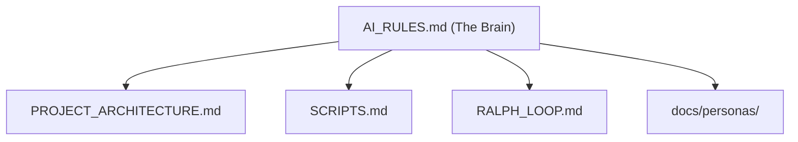

# 🧠 The Project Brain (AI Rules)

> **Instructions**: Read this file first. It contains the DNA of this project.

## 0. 🗺️ Source of Truth (SSOT)

This document is the central orchestrator for all AI behaviors.

- **Architecture**: See [PROJECT_ARCHITECTURE.md](file:///Users/danielkuschmierz/Prepflow-Ecosystem/prepflow-web/docs/PROJECT_ARCHITECTURE.md)
- **Automation**: See [SCRIPTS.md](file:///Users/danielkuschmierz/Prepflow-Ecosystem/prepflow-web/docs/SCRIPTS.md)
- **Methodology**: See [RALPH_LOOP.md](file:///Users/danielkuschmierz/Prepflow-Ecosystem/prepflow-web/docs/methodology/RALPH_LOOP.md)

## 1. ⚡ Quick Commands

| Action           | Command                         | Description                                        |
| :--------------- | :------------------------------ | :------------------------------------------------- |
| **Commit Guard** | `./scripts/pre-commit-check.sh` | Runs Security, Health, Architecture checks (Fast). |
| **Verify All**   | `./scripts/safe-merge.sh`       | Runs Guards + Tests + Build (Slow).                |
| **Test**         | `npm test`                      | Runs 950+ smoke tests.                             |
| **Teleport**     | `npm run teleport`              | Dumps context for new sessions.                    |

## 2. 🎨 Coding Style (Strict)

- **Next.js 15**:
  - **Server Components**: Async by default.
  - **Params**: ALWAYS unwrap params (`await params` or `use(params)`).
  - **Client Components**: Use `'use client'` at the very top.
- **Styling**: Vanilla CSS or Tailwind (if requested). No CSS-in-JS libraries.
- **Structure**:
  - `components/`: Reusable UI only.
  - `lib/`: Business logic, helpers, API clients.
  - `hooks/`: React state logic.
  - `scripts/`: Automation (The Brain).
- **Complexity**:
  - **No Spaghetti Code**: Deep nesting (> 4-5 levels) is forbidden.
  - **Decomposition**: Extract logic into small, single-purpose helper functions and separate components.
  - **Custom Hooks**: Extract complex `useEffect` or state logic into `hooks/`.

## 3. 🛡️ The Brain's Laws

1.  **No Secrets**: Do not hardcode API keys. Use `.env.local`. The Auditor will block you.
2.  **No Bloat**: Images > 500KB are forbidden in `public/`.
3.  **No Debt**: TODOs > 50 block the build.
4.  **No Circular Deps**: The Architect is watching.
5.  **No Magic Numbers**: Use `lib/constants.ts` for everything (Time, Size, ID limits).
6.  **No Spaghetti Data**: Static data > 50 lines MUST live in `lib/data/` or a JSON file.
7.  **No Hardcoded URLs**: Use `APP_BASE_URL` from constants. `localhost:3000` is FORBIDDEN.
8.  **Component Size**: Components > 300 lines MUST be split. Extract sub-components (Header, List, Form).
9.  **Business Logic**: "Profit Margins", "Timeouts", and "Limits" MUST be in `lib/constants.ts`.

## 4. 🧠 Memory Bank (Lessons Learned)

> **Self-Correction Rule**: If you fix a bug or learn a new pattern, you **MUST** add it to this list immediately.

- **[2026-01-05] Route Params**: Next.js 15 `params` are Promises. Accessing `.id` directly throws "undefined". Fix: `const { id } = await params`.
- **[2026-01-11] Massive Avatars**: Gemini generated images were ~5MB. We used `sips` to resize them to ~250KB.
- **[2026-01-11] Test Generation**: `import * as Module` is safer than named imports for smoke testing unknown files.
- **[2026-01-11] Import Hoisting**: Jest hoists ES6 imports. Use `require()` inside `beforeAll` to meaningfully mock `process.env`.
- **[2026-01-14] Ralph Loop**: For complex refactors and bugs, we use the **Ralph Wiggum Technique** (Iterate > Perfection). See [RALPH_LOOP.md](file:///Users/danielkuschmierz/Prepflow-Ecosystem/prepflow-web/docs/methodology/RALPH_LOOP.md).
- **[2026-01-21] Refactoring Strategy**: When refactoring massive type definitions (e.g., `report-item-types.ts`), extract domain-specific types into separate files *first*, then re-export them. This reduces risk and makes the main file readable.
- [2026-01-22] Circular Dependencies: Shared types between components (e.g., `DishesListView` <-> `UnifiedTable`) MUST be extracted to a separate `types.ts` file. Never import a parent component into a child for types.
- [2026-01-22] File Size Limits: `scripts/filesize-ignore.json` is a temporary measure. All "logic" files > 200 lines must be split immediately. Limit enforced.
- [2026-01-28] **Ingredient Matching**: Fuzzy ingredient matching logic is defined in TWO places that MUST stay in sync:
  1. **TypeScript**: `lib/ingredient-normalization.ts` - `INGREDIENT_ALIASES` map + `ingredientsMatch()` function
  2. **PostgreSQL**: `ingredient_aliases` table + `match_recipes_by_stock()` RPC function
  - When adding new aliases, update BOTH files. The database table mirrors the TypeScript map for server-side performance.
- **[2026-01-28] Database Timeouts**: When updating > 2000 rows (e.g., backfilling columns), **NEVER** rely on the Supabase SQL Editor or direct migrations as they time out (10s limit). **Must Use Batch Scripts**: Create a `scripts/fix-xyz.ts` script using `supabase-js` to process updates in small chunks (e.g., 100 at a time). Call a lightweight RPC function for each batch if complex logic is needed.

## 5. 🔄 The Ralph Loop (Methodology)

For any task with high complexity or repeated failures, agents **MUST** follow the Ralph Loop:

1.  **Iterate Immediately**: Don't over-plan; failure is informative data.
2.  **State the Goal**: Define a clear "Completion Promise" (e.g., "DONE" or "TESTS PASSED").
3.  **Self-Correct**: Use error logs to update `task.md` and retry immediately.
4.  **Verify**: Never declare success without a terminal/browser check.

> Use the command **"Ralph this: [task]"** to trigger an autonomous improvement loop.

## 6. 🤖 Recursive Self-Improvement (RSI)

The RSI system matches the **Ralph Loop** methodology with autonomous tooling. It learns from your fixes and prevents regressions.

### Core RSI Commands

| Command              | Description                                                             |
| :------------------- | :---------------------------------------------------------------------- |
| `npm run rsi:status` | **ALWAYS CHECK THIS** before major refactors. Shows active rules.       |
| `npm run rsi:fix`    | Automatically applies learned fixes (linting, patterns, safety).        |
| `npm run rsi:run`    | Triggers the nightly self-improvement loop (Analysis -> Fix -> Evolve). |

### RSI Rules

1.  **Check Status**: Before starting a complex task, run `npm run rsi:status` to see if the RSI has warnings or advice for the current codebase state.
2.  **Prefer Auto-Fix**: If you see a lint error that looks common, try `npm run rsi:fix` first.
3.  **Respect the Config**: Rules in `rsi.eslint.config.mjs` are generated from successful valid patterns. Do not disable them manually; instead, fix the code to comply.
