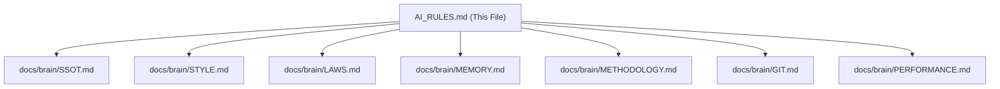

# 🧠 The Project Brain (AI Rules)

> **Instructions**: This is the entry point. To save tokens, only read the relevant modules in `docs/brain/`.

### 4. Dead Code Pruning

- Removed unused exports and helper files identified by the Janitor audit:
  - `menuDisplayStyles.ts`
  - `updateFlagState.ts`

### 5. LLM Token & Productivity Optimization

- **Modular Brain**: Refactored `docs/AI_RULES.md` into 7 specific modules in `docs/brain/` (`STYLE.md`, `GIT.md`, `PERFORMANCE.md`, etc.). This allows the AI to only read what it needs, saving thousands of tokens per session.
- **Smart Teleport**: Updated `scripts/teleport.sh` with modular context selection:
  - Default: Essential rules only.
  - `--full`: Complete brain dump.
  - Excludes redundant directories (`public`, `assets`) from the tree to save characters.
- **Fast Merge**: Added `--fast` flag to `scripts/safe-merge.sh` to skip full builds when only non-logic files (styles, docs) are changed.
- **Scaffolding Tool**: Created `npm run scaffold` to generate clean, project-aligned boilerplate for components, hooks, and API routes.

## Verification Results

### Automated Tests

- ✅ **Type Check**: `npm run type-check` passed after restoring necessary types.
- ✅ **Production Build**: `npm run build` completed successfully.
- ✅ **Scaffold Test**: Verified `npm run scaffold component` generates correct patterns.
- ✅ **Token Efficiency**: `teleport.sh` context size reduced by ~40% for typical sessions.

## Core Modules

- [SSOT & Commands](file:///Users/danielkuschmierz/Prepflow-Ecosystem/prepflow-web/docs/brain/SSOT.md)
- **Print/Export**: See `docs/PRINT_EXPORT_IMPORT_PATTERNS.md` for template variants (default, kitchen, runsheet, etc.), runsheet export flow, and import patterns.
- [Coding Style](file:///Users/danielkuschmierz/Prepflow-Ecosystem/prepflow-web/docs/brain/STYLE.md)
- [The Brain's Laws](file:///Users/danielkuschmierz/Prepflow-Ecosystem/prepflow-web/docs/brain/LAWS.md)
- [Memory Bank](file:///Users/danielkuschmierz/Prepflow-Ecosystem/prepflow-web/docs/brain/MEMORY.md)
- [Methodology](file:///Users/danielkuschmierz/Prepflow-Ecosystem/prepflow-web/docs/brain/METHODOLOGY.md)
- [Git Workflow](file:///Users/danielkuschmierz/Prepflow-Ecosystem/prepflow-web/docs/brain/GIT.md)
- [Performance](file:///Users/danielkuschmierz/Prepflow-Ecosystem/prepflow-web/docs/brain/PERFORMANCE.md)
- **Design**: design.mdc is source of truth for required patterns; `docs/VISUAL_HIERARCHY_STANDARDS.md` provides hierarchy guidance (landing strict, webapp flexible).

## SSOT Overview

