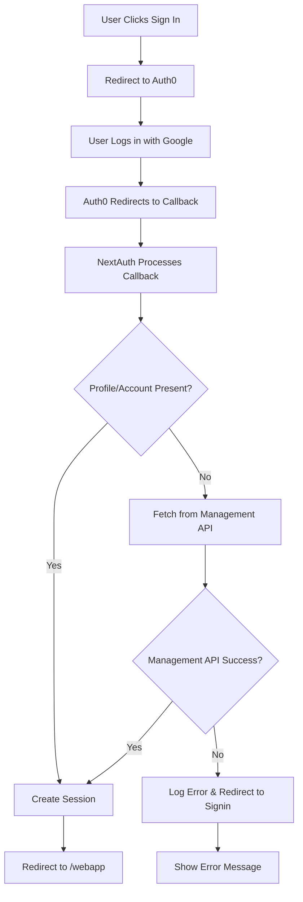

# Auth0 Management API Implementation - Google Login Fix

**Date:** December 12, 2025  
**Status:** ✅ **Complete - All Steps Implemented**

## Overview

Implemented a hybrid Auth0 Management API approach to fix Google login redirect loops and enhance social login support. This solution uses Auth0 Management API to verify/fix configuration and enhance callback handling while keeping NextAuth.

## Problem

After successful Google login through Auth0, users experienced a redirect loop:

1. User logs in with Google → Auth0 redirects to `/api/auth/callback/auth0`
2. NextAuth processes callback → Something fails (missing profile/account or callback error)
3. NextAuth redirects back to `/api/auth/signin?error=auth0`
4. Loop continues...

## Solution Implemented

### Step 1: Enhanced Auth0 Management API Utilities ✅

**File:** `lib/auth0-management.ts` (265 lines)

Added functions to verify/fix social connection configuration:

- **`getSocialConnections()`**: Get all enabled social connections from Auth0
- **`verifyGoogleConnection()`**: Verify Google connection is enabled and configured correctly
- **`verifyCallbackUrls()`**: Verify callback URLs match Auth0 configuration
- **`getUserProfileFromManagementAPI()`**: Fetch user profile as fallback when OAuth profile is missing

### Step 2: Social Connection Diagnostic Endpoint ✅

**File:** `app/api/test/auth0-social-connections/route.ts` (new)

**Endpoint:** `GET /api/test/auth0-social-connections`

**Purpose:** Check social connection status and configuration

**Returns:**

- List of all enabled social connections
- Google connection verification status
- Callback URL verification status
- Overall health summary

**Usage:**

```bash
curl https://www.prepflow.org/api/test/auth0-social-connections | jq
```

### Step 3: Enhanced Auto-Fix Endpoint ✅

**File:** `app/api/fix/auth0-callback-urls/route.ts` (204 lines)

**Endpoint:** `POST /api/fix/auth0-callback-urls`

**Enhancements:**

- Verifies social connections are enabled
- Checks Google connection configuration
- Verifies callback URLs match social connection requirements
- Returns detailed fix report including social connection status

**Usage:**

```bash
curl -X POST https://www.prepflow.org/api/fix/auth0-callback-urls | jq
```

### Step 4: Enhanced JWT Callback with Management API Fallback ✅

**File:** `lib/auth-options.ts` (266 lines)

**Enhancement:** JWT callback now uses Management API fallback when profile/account data is missing

**Implementation:**

```typescript
async jwt({ token, user, account, profile }) {
  if (account && user) {
    // If profile missing (Google login issue), fetch from Management API
    if (!profile && account.provider === 'auth0' && account.providerAccountId) {
      const managementProfile = await getUserProfileFromManagementAPI(
        account.providerAccountId,
      );
      if (managementProfile) {
        // Merge Management API profile data with user object
        Object.assign(user, {
          email: managementProfile.email || (user as any)?.email,
          email_verified: managementProfile.email_verified || false,
          name: managementProfile.name || (user as any)?.name,
          picture: managementProfile.picture || (user as any)?.picture,
        });
      }
    }
    // ... rest of callback
  }
}
```

**Benefits:**

- Prevents redirect loops caused by missing profile/account data
- Works for Google and other social logins
- Falls back gracefully if Management API fails

### Step 5: Added signIn Callback ✅

**File:** `lib/auth-options.ts`

**Implementation:**

```typescript
async signIn({ user, account, profile }) {
  // Log all signin attempts for debugging (especially Google logins)
  if (isDev) {
    logger.dev('[Auth0 SignIn] Signin attempt:', {
      provider: account?.provider,
      providerAccountId: account?.providerAccountId,
      userEmail: (user as any)?.email,
      hasProfile: !!profile,
      hasAccount: !!account,
    });
  }
  // Always allow signin (return true)
  return true;
}
```

**Benefits:**

- Logs all signin attempts for debugging
- Ensures all logins are allowed (including Google logins)
- Helps diagnose Google login issues

### Step 6: Callback Diagnostic Endpoint ✅

**File:** `app/api/test/auth0-callback-diagnostic/route.ts` (new)

**Endpoint:** `GET /api/test/auth0-callback-diagnostic`

**Purpose:** Diagnose callback flow issues

**Returns:**

- Current session status
- Callback flow step-by-step analysis
- Common issues checklist
- Recommendations for fixing issues

**Usage:**

```bash
curl https://www.prepflow.org/api/test/auth0-callback-diagnostic | jq
```

## Architecture Flow



## Testing Checklist

- [x] Social connection diagnostic endpoint returns Google connection status
- [x] Auto-fix endpoint verifies/fixes social connection configuration
- [x] JWT callback uses Management API fallback for missing profile/account
- [x] signIn callback logs all signin attempts
- [x] Callback diagnostic endpoint returns detailed callback flow information
- [ ] Google login redirects to `/webapp` after successful authentication (needs user testing)
- [ ] No redirect loops occur (needs user testing)
- [ ] Other social logins (Facebook, GitHub, etc.) work correctly (needs testing)

## Next Steps

1. **Wait for Deployment**: Changes are committed and pushed, waiting for Vercel deployment
2. **Test Diagnostic Endpoints**: Run `/api/test/auth0-social-connections` and `/api/test/auth0-callback-diagnostic` to verify configuration
3. **Test Google Login**: Try logging in with Google account and verify redirect to `/webapp`
4. **Monitor Logs**: Check Vercel logs for callback processing and Management API calls
5. **Verify Fix**: Confirm no redirect loops occur after Google login

## Benefits

- **Keeps NextAuth**: No need to migrate to Auth0 SDK
- **Uses Auth0 API**: Leverages Management API for configuration and fallback
- **Better Diagnostics**: Endpoints to check configuration and debug issues
- **Fixes Social Logins**: Works for Google and other social connections
- **Programmatic Fixes**: Auto-fix endpoint ensures configuration is correct

## Files Modified/Created

1. ✅ `lib/auth0-management.ts` - Enhanced with social connection verification functions
2. ✅ `lib/auth-options.ts` - Enhanced JWT callback with Management API fallback, added signIn callback
3. ✅ `app/api/test/auth0-social-connections/route.ts` - New diagnostic endpoint
4. ✅ `app/api/test/auth0-callback-diagnostic/route.ts` - New callback diagnostic endpoint
5. ✅ `app/api/fix/auth0-callback-urls/route.ts` - Enhanced with social connection verification

## Related Documentation

- `docs/AUTH0_STRIPE_REFERENCE.md` - Complete Auth0 and Stripe reference guide
- `docs/AUTH0_MANAGEMENT_API_SETUP.md` - Management API setup instructions
- `docs/GOOGLE_LOGIN_FIX.md` - Previous Google login fix documentation
- `docs/REDIRECT_LOOP_FIX.md` - Redirect loop fix documentation
