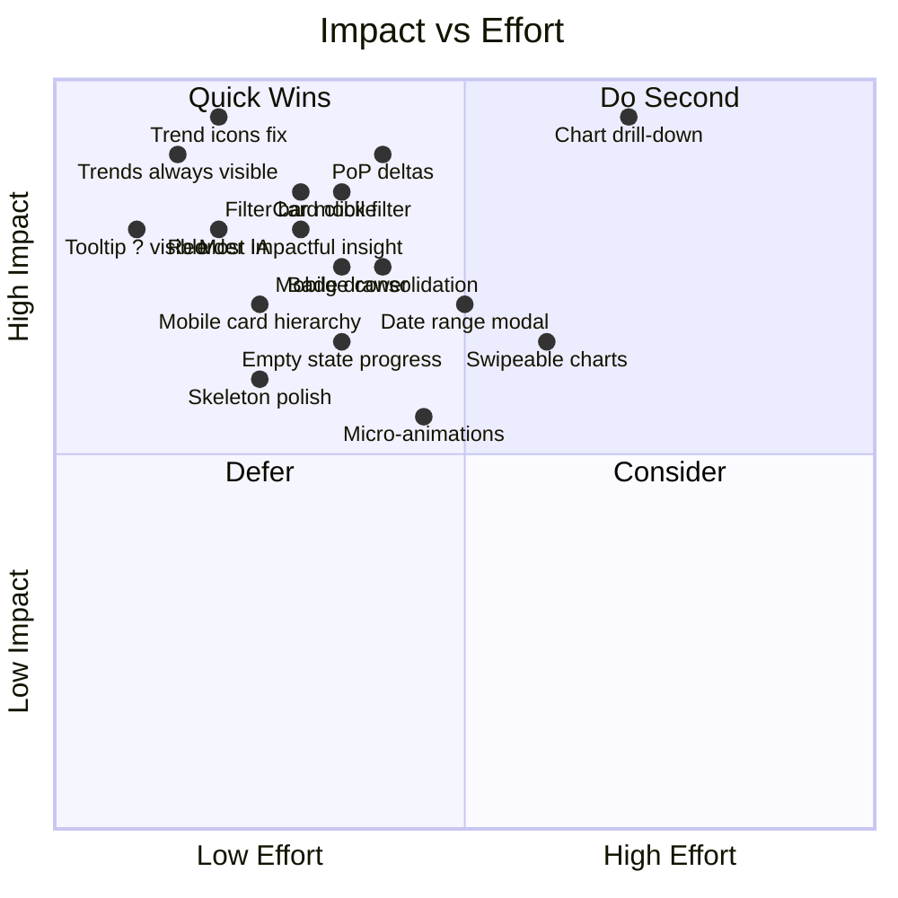
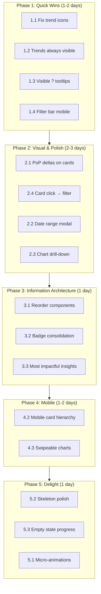

# PrepFlow Performance Tab UX/UI Improvement Plan

**Goal:** Make the Performance tab the absolute best possible experience.  
**Scope:** `app/webapp/performance/`  
**Prioritization:** Impact × Effort (Quick Wins → Polish)

---

## Impact/Effort Matrix

---

## 1. High-Impact Quick Wins

| #   | Task                                                                    | Effort | Impact | Files / Components                                                               |
| --- | ----------------------------------------------------------------------- | ------ | ------ | -------------------------------------------------------------------------------- |
| 1.1 | **Fix misleading trend icons in SummaryCards**                          | Low    | High   | `PerformanceSummaryCards.tsx`                                                    |
| 1.2 | **Show Trends key metrics always (not collapsed)**                      | Low    | High   | `PerformanceTrends.tsx`                                                          |
| 1.3 | **Add visible "?" for methodology/score tooltips**                      | Low    | Medium | `PerformanceHeader.tsx`, `MethodologyTooltip.tsx`, `PerformanceScoreTooltip.tsx` |
| 1.4 | **Improve filter bar: split actions vs filters, collapsible on mobile** | Medium | High   | `PerformanceFilters.tsx`, `performance-mobile.css`                               |

### 1.1 Fix misleading trend icons in SummaryCards

**Current behavior:** `getTrendIcon()` in `PerformanceSummaryCards.tsx` (lines 88–95) compares values to **static thresholds** (e.g. `threshold: 0` for profit, `threshold: 70` for avg margin). Icons imply "trend vs previous period" but actually mean "above/below arbitrary number".

**Target behavior:** When `previousPeriodData` exists, use period-over-period comparison. Otherwise hide trend icons or show "N/A" / neutral state.

**Implementation outline:**

- Pass `previousPeriodData` from `PerformanceClient.tsx` → `PerformanceSummaryCards`
- Add optional `previousItems?: PerformanceItem[]` prop
- Compute current vs previous totals (mirror logic in `PerformanceTrends.tsx`)
- Replace `getTrendIcon(value, threshold)` with `getTrendIcon(current, previous)` when previous data exists

---

### 1.2 Show Trends section key metrics always (not collapsed)

**Current behavior:** `PerformanceTrends.tsx` uses `useState(false)` for `isExpanded`. Content is hidden until "Show Trends" is clicked.

**Target behavior:** Key metrics (profit, revenue, units sold with % change) always visible. Optionally allow collapsing secondary details (previous period values).

**Implementation outline:**

- Remove expand/collapse for the three main metric cards
- Keep content in the same layout; remove `{isExpanded && ...}` wrapper
- Optionally add "Show details" for previous-period breakdown if needed

---

### 1.3 Add visible "?" for methodology/score tooltips

**Current behavior:** `PerformanceHeader.tsx` uses `Info` icon and hover to show tooltips. No explicit "?" affordance; discoverability is poor.

**Target behavior:** Visible "?" or info icon with label (e.g. "Learn more") next to "Performance Score" and "Methodology" so users know help exists.

**Implementation outline:**

- Add `aria-label` and optional visible "?" text or icon
- Ensure touch devices can tap to open (not just hover)
- Consider small `InlineHint` or tooltip trigger with "?" in header

---

### 1.4 Improve filter bar: split actions vs filters, collapsible on mobile

**Current behavior:** `PerformanceFilters.tsx` combines Import, Print, Export, result count, `MenuItemClassFilters`, search, and sort in one row. On mobile this becomes cramped.

**Target behavior:**

- **Desktop:** Keep single row; visually separate "Actions" (Import, Print, Export) from "Filters" (class, search, sort)
- **Mobile (< desktop breakpoint):** Collapsible "Filters" drawer. Actions stay visible; "Filters" opens a drawer with class filters, search, sort

**Implementation outline:**

- Add `PerformanceFiltersMobile.tsx` or use responsive layout in `PerformanceFilters.tsx`
- Use `desktop:` breakpoint (1025px) for split
- Mobile: "Filters" button → opens drawer (z-50+) with `MenuItemClassFilters`, search, sort
- Optional: Use existing `components/ui` drawer/sheet if available

---

## 2. Visual Hierarchy & Polish

| #   | Task                                                                | Effort | Impact | Files / Components                                                                                                                     |
| --- | ------------------------------------------------------------------- | ------ | ------ | -------------------------------------------------------------------------------------------------------------------------------------- |
| 2.1 | **Add period-over-period deltas (% change badges) to SummaryCards** | Medium | High   | `PerformanceSummaryCards.tsx`                                                                                                          |
| 2.2 | **Refine date range UX: modal/dropdown for custom range**           | Medium | Medium | `PerformanceDateRange.tsx`                                                                                                             |
| 2.3 | **Chart-to-table drill-down (click category → filter table)**       | High   | High   | `PerformanceChartsLazy.tsx`, `PerformancePieChart.tsx`, `PerformanceBarChart.tsx`, `PerformanceClient.tsx`, `usePerformanceFilters.ts` |
| 2.4 | **Summary card click → filter table by category**                   | Medium | High   | `PerformanceSummaryCards.tsx`, `PerformanceClient.tsx`, `usePerformanceFilters.ts`                                                     |

### 2.1 Add period-over-period deltas to SummaryCards

**Dependencies:** Requires `previousPeriodData` (already available from `usePerformanceData`).

**Target behavior:** When previous period data exists, show "+12.3%" / "-5.1%" badge on Total Profit, Avg Margin, and optionally Categories card.

**Implementation outline:**

- Same data flow as 1.1
- Add small badge below or beside the primary metric with % change
- Use `text-[var(--color-success)]` / `text-[var(--color-error)]` for positive/negative

---

### 2.2 Refine date range UX: modal/dropdown for custom range

**Current behavior:** `PerformanceDateRange.tsx` shows inline date inputs when "Custom Range" is selected. Presets and custom share the same card.

**Target behavior:** "Custom Range" opens a modal or dropdown with calendar/date picker instead of inline inputs. Cleaner layout, better mobile UX.

**Implementation outline:**

- Extract custom range into `PerformanceDateRangeModal.tsx` or use popover
- Trigger: "Custom Range" preset click → open modal
- Modal contains start/end date inputs + optional calendar component
- On apply, close and call `onDateRangeChange`

---

### 2.3 Chart-to-table drill-down

**Current behavior:** Charts (`PerformancePieChart`, `PerformanceBarChart`) are read-only. No link to table.

**Target behavior:** Clicking a category (e.g. "Chef's Kiss" slice in pie, "Bargain Bucket" bar) applies `menuItemClass` filter and scrolls to table.

**Implementation outline:**

- Add `onCategoryClick?: (menuItemClass: string) => void` to chart components
- `PerformanceClient` passes handler that calls `updateFilters({ menuItemClass: [clickedClass] })`
- Filter type: `menuItemClass` already exists in `PerformanceFiltersType`
- Scroll to table container after filter change (`tableContainerRef.current?.scrollIntoView()`)
- Wire through `PerformanceChartsLazy` → `PerformancePieChart`, `PerformanceBarChart`

---

### 2.4 Summary card click → filter table by category

**Target behavior:** Clicking "Chef's Kiss" count in the Categories card filters the table to that class. Same as chart drill-down but from cards.

**Implementation outline:**

- Add `onCategoryClick?: (menuItemClass: string) => void` to `PerformanceSummaryCards`
- Make category rows clickable (cursor-pointer, hover state)
- `PerformanceClient` wires to `updateFilters({ menuItemClass: [menuItemClass] })`

---

## 3. Information Architecture

| #   | Task                                                                  | Effort | Impact | Files / Components                                                             |
| --- | --------------------------------------------------------------------- | ------ | ------ | ------------------------------------------------------------------------------ |
| 3.1 | **Reorder components for better scanability**                         | Low    | High   | `PerformanceClient.tsx`                                                        |
| 3.2 | **Reduce table row badge clutter**                                    | Medium | Medium | `PerformanceTableRow.tsx`, `PerformanceTableMobileCard.tsx`                    |
| 3.3 | **Insights: add "Most impactful" badge, prioritize by actionability** | Medium | Medium | `PerformanceInsights.tsx`, `usePerformanceInsights.ts`, `insightGenerators.ts` |

### 3.1 Reorder components for better scanability

**Current order (PerformanceClient.tsx):**

1. PerformanceHeader
2. PageTipsCard
3. PerformanceWeatherInsight
4. PerformanceDateRange
5. PerformanceTrends (conditional)
6. PerformanceSummaryCards
7. PerformanceCharts
8. PerformanceInsights
9. Table (with filters + pagination)

**Proposed order:**

1. PerformanceHeader
2. PageTipsCard
3. PerformanceWeatherInsight
4. PerformanceDateRange
5. **PerformanceSummaryCards** (hero metrics first)
6. **PerformanceTrends** (always render when previousPeriodData; expand by default)
7. PerformanceCharts
8. PerformanceInsights
9. Table

**Rationale:** Hero metrics (SummaryCards) and period-over-period trends are highest value; show before charts and detailed table.

---

### 3.2 Reduce table row badge clutter

**Current behavior:** `PerformanceTableRow.tsx` and `PerformanceTableMobileCard.tsx` show:

- `menu_item_class` (Chef's Kiss, Hidden Gem, etc.)
- `profit_category` (High/Low)
- `popularity_category` (High/Low)

Redundant: `menu_item_class` is the composite of profit + popularity. Showing all three is noisy.

**Target behavior:** Show only `menu_item_class` as the primary badge. Optionally show profit/popularity on hover or in a secondary row, or remove entirely from row.

**Implementation outline:**

- `PerformanceTableRow.tsx`: Remove or collapse `profit_category` and `popularity_category` badges. Keep `menu_item_class`.
- `PerformanceTableMobileCard.tsx`: Same consolidation
- If needed for power users, add toggle "Show raw categories" in filters (optional)

---

### 3.3 Insights: "Most impactful" badge and actionability order

**Current behavior:** All insights shown in grid; no explicit prioritization.

**Target behavior:** Top 1–2 insights get "Most impactful" badge. Sort by actionability (e.g. potential revenue impact, urgency).

**Implementation outline:**

- In `usePerformanceInsights` or `insightGenerators.ts`, compute impact score
- Sort insights by impact before render
- Add badge to first 1–2 items in `PerformanceInsights.tsx`

---

## 4. Mobile Excellence

| #   | Task                                                            | Effort | Impact | Files / Components                                    |
| --- | --------------------------------------------------------------- | ------ | ------ | ----------------------------------------------------- |
| 4.1 | **Simplify filter bar on mobile (collapsible drawer)**          | Medium | High   | Covered in 1.4                                        |
| 4.2 | **Improve mobile card hierarchy in PerformanceTableMobileCard** | Medium | Medium | `PerformanceTableMobileCard.tsx`                      |
| 4.3 | **Swipeable chart carousel for mobile**                         | High   | Medium | `PerformanceChartsLazy.tsx`, `performance-mobile.css` |

### 4.2 Improve mobile card hierarchy in PerformanceTableMobileCard

**Current behavior:** All metrics in flat 2-column grid. Category badge + profit/popularity badges at bottom. Visual priority unclear.

**Target behavior:** Primary metrics (Profit %, Profit ex GST, Name) more prominent. Secondary (Revenue, Cost, Sold) de-emphasized. Single consolidated class badge.

**Implementation outline:**

- Reorder grid: Profit and key metrics first
- Use typography: larger font for primary, smaller for secondary
- Apply badge consolidation from 3.2

---

### 4.3 Swipeable chart carousel for mobile

**Current behavior:** Charts stack vertically. On small screens, many charts = long scroll.

**Target behavior:** On mobile, show charts in a swipeable carousel (one chart per "page") with dots/indicators.

**Implementation outline:**

- Use CSS scroll-snap or a lightweight carousel (e.g. embla-carousel, or custom)
- Wrap chart grid in scroll container with `scroll-snap-type: x mandatory`
- Each chart: `scroll-snap-align: start` and min-width: 100%
- Add dot indicators for current chart

---

## 5. Delight & Polish

| #   | Task                                                                      | Effort | Impact | Files / Components                                     |
| --- | ------------------------------------------------------------------------- | ------ | ------ | ------------------------------------------------------ |
| 5.1 | **Micro-animations on metric changes**                                    | Medium | Low    | `PerformanceSummaryCards.tsx`, `PerformanceTrends.tsx` |
| 5.2 | **Skeleton improvements for chart loading**                               | Low    | Medium | `PerformanceCharts.tsx`, `PerformanceChartsLazy.tsx`   |
| 5.3 | **Empty state: more engaging, progress indicator during data generation** | Medium | Medium | `PerformanceEmptyState.tsx`                            |

### 5.1 Micro-animations on metric changes

**Target behavior:** When values update (e.g. after date range change), animate number transitions (count-up/count-down) and subtle pulse on trend badges.

**Implementation outline:**

- Use Framer Motion `animate` or CSS `@keyframes` for number transitions
- Optional: `framer-motion` for `layout` or `AnimatePresence` when cards update

---

### 5.2 Skeleton improvements for chart loading

**Current behavior:** `PerformanceCharts.tsx` shows generic `animate-pulse` rectangle while lazy loading.

**Target behavior:** Skeleton matches chart layout (e.g. bar shapes, pie placeholder). Use `ChartSkeleton` from design system if available.

**Implementation outline:**

- Create or use `ChartSkeleton` variant from `LoadingSkeleton`
- Match approximate structure of area/bar/pie charts

---

### 5.3 Empty state: progress indicator during data generation

**Current behavior:** `PerformanceEmptyState.tsx` shows "Generate Sales Data" button. On click, API runs with no visible progress until success/error.

**Target behavior:** During generation, show progress indicator (spinner, "Generating…", or step-based progress). More engaging empty state visuals.

**Implementation outline:**

- Add loading state in `handleGenerateSalesData`
- Show indeterminate or step-based progress UI
- Optional: Add illustration or animation to empty state

---

## Implementation Flow (Recommended Order)

---

## File Reference Quick Index

| Component / File                                            | Primary Changes                                                                    |
| ----------------------------------------------------------- | ---------------------------------------------------------------------------------- |
| `PerformanceClient.tsx`                                     | Reorder sections, wire `previousPeriodData`, `onCategoryClick`, scroll-to-table    |
| `PerformanceSummaryCards.tsx`                               | Fix trend icons, add PoP deltas, `onCategoryClick`, optional animations            |
| `PerformanceTrends.tsx`                                     | Remove collapse, always show metrics                                               |
| `PerformanceHeader.tsx`                                     | Visible ? for tooltips                                                             |
| `PerformanceFilters.tsx`                                    | Split actions/filters, mobile drawer                                               |
| `PerformanceDateRange.tsx`                                  | Custom range modal/dropdown                                                        |
| `PerformanceChartsLazy.tsx`                                 | `onCategoryClick`, mobile carousel                                                 |
| `PerformancePieChart.tsx`, `PerformanceBarChart.tsx`        | `onCategoryClick` on segments/bars                                                 |
| `PerformanceTableRow.tsx`, `PerformanceTableMobileCard.tsx` | Badge consolidation                                                                |
| `PerformanceInsights.tsx`                                   | "Most impactful" badge, sort by actionability                                      |
| `PerformanceEmptyState.tsx`                                 | Progress indicator, richer empty state                                             |
| `PerformanceCharts.tsx`                                     | Better chart skeleton                                                              |
| `usePerformanceFilters.ts`                                  | Support `onCategoryClick`-driven filter updates (already supports `menuItemClass`) |

---

## Success Metrics

- **Perceived performance:** Chart skeletons feel intentional; no abrupt layout shifts
- **Discoverability:** Methodology/score help is obvious (visible ?)
- **Mobile:** Filter bar usable without horizontal scroll; chart browsing comfortable
- **Actionability:** One click from summary/chart to filtered table
- **Clarity:** Trend icons reflect period-over-period; badges reduced; insights prioritized
