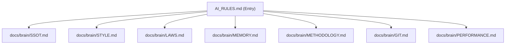

# 🗺️ Source of Truth & Quick Commands

## Source of Truth (SSOT)

This directory (`docs/brain/`) is the central orchestrator for all AI behaviors.

## Quick Commands

| Action           | Command                         | Description                                                                                         |
| :--------------- | :------------------------------ | :-------------------------------------------------------------------------------------------------- |
| **Commit Guard** | `./scripts/pre-commit-check.sh` | Runs merge conflict, curbos protection, file size, lint-staged. Heavy checks run in CI.             |
| **Verify All**   | `./scripts/safe-merge.sh`       | Delegates to `npm run pre-deploy`, then merge. Use `--fast` for lint + type-check only.             |
| **Pre-Deploy**   | `npm run pre-deploy`            | Single source of truth: lint, type-check, test, file size, cleanup, build. Run before push to main. |
| **Test**         | `npm test`                      | Runs 950+ smoke tests.                                                                              |
| **Teleport**     | `npm run teleport`              | Dumps context for new sessions.                                                                     |
